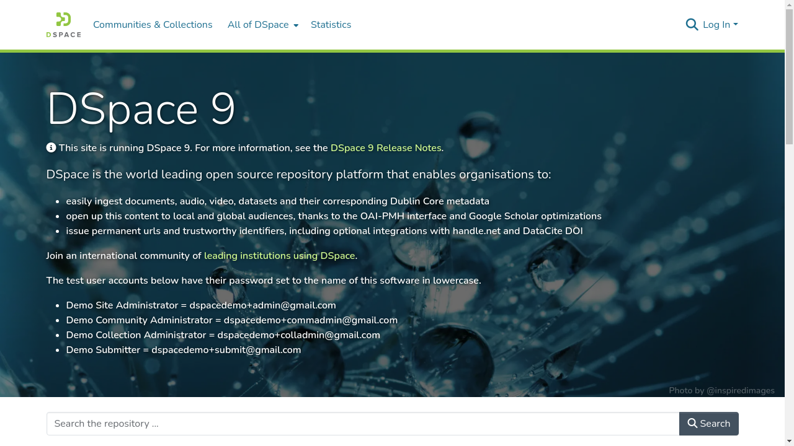
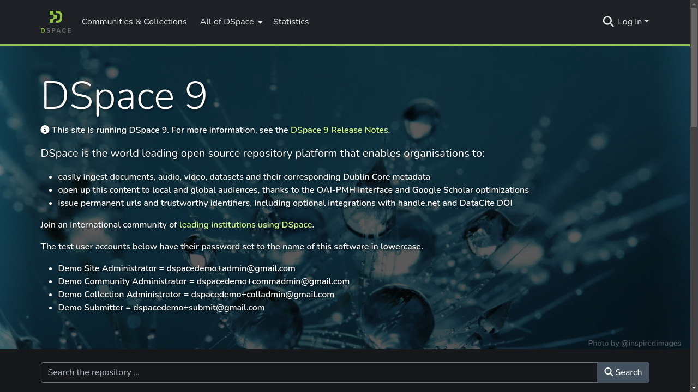
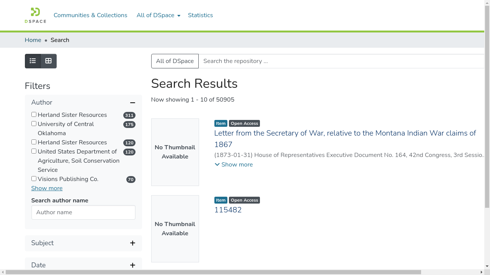
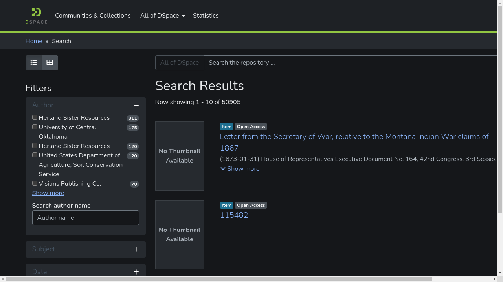
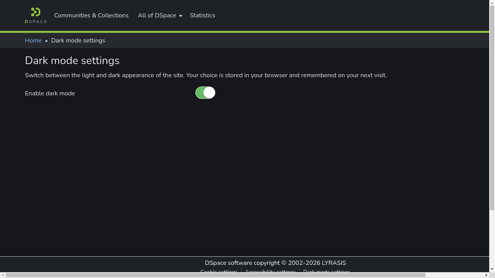
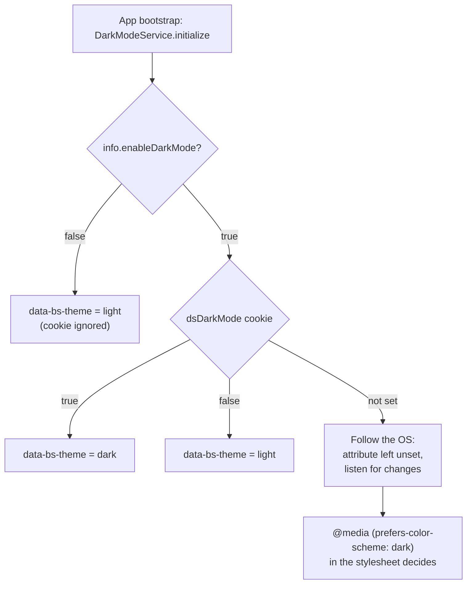

 DSpace UI — Dark Mode
=============================

> A site-wide dark appearance for the  DSpace 9.2 user interface
> (a fork of [DSpace/dspace-angular](https://github.com/DSpace/dspace-angular)).

Visitors can switch the whole repository UI between a light and a dark appearance, or let it follow
their operating system. The choice is remembered across visits and is applied during server-side
rendering, so there is no flash of a light page before the theme kicks in.

| Light | Dark |
| --- | --- |
|  |  |
|  |  |

Table of Contents
-----------------

- [Using it](#using-it)
- [Configuration](#configuration)
- [Implementation](#implementation)
  - [How the preference is resolved](#how-the-preference-is-resolved)
  - [Server-side rendering](#server-side-rendering)
  - [How the styling works](#how-the-styling-works)
  - [Files](#files)
- [Contrast and accessibility](#contrast-and-accessibility)
- [Extending it](#extending-it)
- [Testing](#testing)
- [Build and deploy](#build-and-deploy)
- [Upstream DSpace documentation](#upstream-dspace-documentation)

Using it
--------

There are two ways dark mode turns on:

1. **The settings page** — *Dark mode settings* in the site footer, or `/info/dark-mode` directly.
   The toggle takes effect immediately and is stored in the `dsDarkMode` cookie for 365 days. An
   explicit choice always wins over the operating system.
2. **The operating system** — visitors who have never touched the toggle get whatever
   `prefers-color-scheme` reports, and the page follows along live if they change that setting while
   the tab is open.

<p align="center">
  
</p>

Configuration
-------------

Dark mode is controlled by a single flag in the `info` block of the runtime config
(`config/config.prod.yml` in production, `config/config.yml` in development):

```yaml
info:
  # Whether dark mode is available. When false, the "Dark mode settings" footer link is hidden
  # and the settings page is disabled.
  enableDarkMode: true
```

It can also be set with an environment variable, following the usual DSpace convention:

```bash
DSPACE_INFO_ENABLEDARKMODE=false
```

It defaults to `true` (see `src/config/default-app-config.ts`).

When set to `false`:

- the *Dark mode settings* link is removed from the footer (`FooterComponent.showDarkModeSettings`);
- the `/info/dark-mode` route is not registered at all (`src/app/info/info-routes.ts`);
- `DarkModeService.initialize()` forces `data-bs-theme="light"`, so a **stale `dsDarkMode` cookie or
  a dark OS preference cannot keep a visitor in dark mode** after the feature is switched off.

The flag is read at bootstrap, not per request, so changing it needs a UI restart (and a rebuild if
you changed a compiled default rather than the runtime YAML).

Implementation
--------------

Everything hangs off one attribute: `DarkModeService` sets `data-bs-theme` on the `<html>` element,
which is Bootstrap 5.3's native color-mode switch. Bootstrap recolors its own components from that
attribute; a stylesheet of CSS-variable overrides covers the DSpace surfaces that Bootstrap doesn't 
know about.

### How the preference is resolved



The third branch is the subtle one. When there is no explicit choice, the service deliberately
**leaves the attribute off** rather than guessing, so the stylesheet's `prefers-color-scheme` block
paints the first frame correctly even before any JavaScript has run. Once the browser is running, the
service sets the attribute explicitly — so Bootstrap's own components pick dark mode up too — and it
subscribes to the media query, so an OS change is reflected without a reload. That subscription only
acts while no explicit choice is stored.

### Server-side rendering

`AppComponent.ngOnInit()` calls `darkModeService.initialize()`, which runs on the server as well as in
the browser. DSpace's `CookieService` has a server-side implementation backed by the incoming request,
so the SSR pass can read `dsDarkMode` and emit `<html data-bs-theme="dark">` in the very first bytes of
HTML. That is what avoids a light flash on a hard reload. The OS preference cannot be read on the
server, which is exactly why the "no explicit choice" case falls back to the media query instead.

One caveat worth knowing when testing: DSpace caches SSR output for known bots by default
(`cache.serverSide.botCache`, 1,000 pages / 24 h), and `curl` is detected as a bot. A cached page can
carry the `data-bs-theme` of whoever triggered the render — harmless in the browser, because the
client corrects it on hydration, but it makes `curl` an unreliable way to check this. Use a real
browser or the Cypress spec below.

### How the styling works

`src/themes/dspace/styles/_dark-mode.scss` defines a `ds-dark-theme` mixin that **only assigns
variables** — it does not target individual components. Recoloring then happens automatically,
because the base styles and theme components already read those variables:

- **Bootstrap variables** (`--bs-body-bg`, `--bs-link-color`, `--bs-input-bg`, `--bs-table-*`, …).
  DSpace re-declares several of these at `:root`, which would otherwise beat Bootstrap's own
  `[data-bs-theme=dark]` block, so they are restated here.
- **DSpace variables** (`--ds-header-bg`, `--ds-navbar-link-color`, `--ds-breadcrumb-bg`,
  `--ds-thumbnail-placeholder-*`, …). Their light values were lifted out of hard-coded SASS literals
  into `_theme_css_variable_overrides.scss`, so both modes are driven by the same names and light
  mode renders exactly as it did before.

The mixin is applied through two selectors:

```scss
// 1. Explicit choice (settings toggle, or the OS default written by DarkModeService)
[data-bs-theme='dark'] { @include ds-dark-theme; }

// 2. OS preference during SSR / before the service runs — only while no explicit choice exists.
//    An explicit light choice sets data-bs-theme="light", which is excluded here.
@media (prefers-color-scheme: dark) {
  :root:not([data-bs-theme]) { @include ds-dark-theme; }
}
```

The import sits in `src/themes/dspace/styles/_global-styles.scss` after the base global styles, so its
values win over the light defaults.

A handful of rules can't be expressed as plain variable assignments and are scoped inside the mixin:
`--bs-table-striped-bg` (Bootstrap sets it on the `.table` element itself, so an ancestor-level
override never reaches it), a visible border on the facet/advanced-search panels, and a stronger
border color on form controls.

### Files

| File | Role |
| --- | --- |
| `src/app/dark-mode/dark-mode.service.ts` | Preference resolution, cookie persistence, `data-bs-theme` application, OS-change listener |
| `src/app/dark-mode/dark-mode.service.spec.ts` | Unit tests for the resolution order |
| `src/app/info/dark-mode-settings/` | The settings page (`/info/dark-mode`) with the `ui-switch` toggle |
| `src/themes/dspace/styles/_dark-mode.scss` | The dark palette and every variable override |
| `src/themes/dspace/styles/_theme_css_variable_overrides.scss` | Light-mode values for variables |
| `src/styles/_global-styles.scss` | Hard-coded light literals replaced with variable references |
| `src/app/app.component.ts` | Calls `initialize()` at bootstrap (SSR + browser) |
| `src/app/footer/footer.component.*` | Conditional footer link |
| `src/app/info/info-routes.ts`, `info-routing-paths.ts` | Conditional route + `DARK_MODE_SETTINGS_PATH` |
| `src/config/info-config.interface.ts`, `default-app-config.ts`, `config/config.example.yml` | The `enableDarkMode` flag |
| `src/assets/i18n/en.json5` | `footer.link.dark-mode`, `info.dark-mode-settings.*` |
| `cypress/e2e/dark-mode-visual.cy.ts` | End-to-end computed-style checks + screenshots |

> **Note:** translations belong in `src/assets/i18n/en.json5` — the theme-level i18n file is not
> loaded by this build.

Contrast and accessibility
--------------------------

The palette in `_dark-mode.scss` was chosen for WCAG AA body text on the dark surfaces:

| Token | Value | Used for |
| --- | --- | --- |
| `$dm-bg` | `#15171a` | Page background |
| `$dm-surface` | `#1e2125` | Cards, header, footer |
| `$dm-surface-2` | `#262a2f` | Inputs, hover, raised surfaces |
| `$dm-border` | `#3a3f44` | Decorative borders and dividers |
| `$dm-input-border` | `#6c757d` | Interactive control boundaries — 3:1 on the input fill (WCAG 1.4.11) |
| `$dm-text` | `#e6e8ea` | Body text |
| `$dm-muted` | `#adb5bd` | Secondary text |
| `$dm-link` / `$dm-link-hover` | `#8ab4f8` / `#aecbfa` | Links |
| `$dm-accent` | `#e06c75` | Lightened crimson accent |

Decorative borders are deliberately kept subtler than control borders: the latter must stay
perceivable at 3:1 to satisfy *Non-text Contrast*, which is why `.form-control`, `.form-select`,
`.form-check-input` and `.input-group-text` get `$dm-input-border` rather than `--bs-border-color`.

Extending it
------------

When adding or theming a component, keep it mode-agnostic:

1. **Never hard-code a color** in a component stylesheet. Reference a Bootstrap `--bs-*` variable, or
   add a `--ds-*` variable with its light value in `_theme_css_variable_overrides.scss`.
2. **Add the dark value** for any new `--ds-*` variable to the `ds-dark-theme` mixin in
   `_dark-mode.scss`. Nothing else should need to change.
3. **Avoid `[data-bs-theme='dark'] .my-component { … }` rules.** If you find yourself reaching for
   one, the component is probably reading a literal color that should have been a variable.
4. **Check both modes**, including hover/focus states and anything sitting on an image or gradient.

Testing
-------

```bash
# Unit tests (includes src/app/dark-mode/dark-mode.service.spec.ts)
npm test

# Visual / computed-style end-to-end checks against a running UI
npx cypress run --spec cypress/e2e/dark-mode-visual.cy.ts --config baseUrl=http://localhost:4000
```

`dark-mode-visual.cy.ts` sets the `dsDarkMode` cookie, then asserts on *computed* styles rather than
class names — body and footer backgrounds resolve dark, navbar links resolve light — across the home,
search, community-list and settings pages, plus a control case proving light mode is untouched. It
writes full-page screenshots to `cypress/screenshots/`.

The unit spec covers the resolution order directly: cookie `true` → dark; cookie `false` → light even
when the OS prefers dark; no cookie → follow the OS; and `enableDarkMode: false` → forced light with
the cookie ignored.

Build and deploy
----------------

```bash
npm install
npm run start:dev      # dev server on http://localhost:4000 with watch

npm run build:prod     # production SSR build into dist/
pm2 restart dspace-ui  # redeploy the running UI
```

Upstream DSpace documentation
-----------------------------

This repository is a fork of [DSpace/dspace-angular](https://github.com/DSpace/dspace-angular) 9.2.
For everything not covered above — installation, the REST API backend, theming, i18n, e2e testing and
deployment — see:

- [DSpace Documentation Wiki](https://wiki.lyrasis.org/display/DSDOC9x/)
- [Installing DSpace](https://wiki.lyrasis.org/display/DSDOC9x/Installing+DSpace)
- [Upstream README](https://github.com/DSpace/dspace-angular/blob/main/README.md)
- [`docs/Configuration.md`](docs/Configuration.md) — how config files and environment variables are layered
